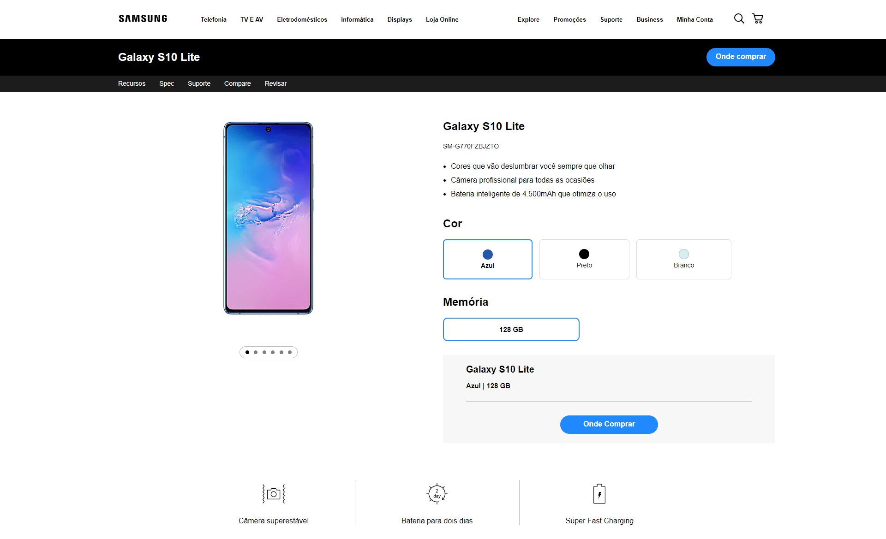

<h1 align="center">Product landing page</h1>

<h1></h1>
<h2>Descrição</h2>

Essa é a minha solução para um exercício proposto no curso de HTML e CSS da B7Web, O objetivo era fazer uma página de apresentação de produto, E para fazê-lo eu usei como base uma página de compra da samsung.

<h2>Tecnologias utilizadas</h2>
<ul>
    <li>HTML5</li>
    <li>CSS3</li>
</ul>